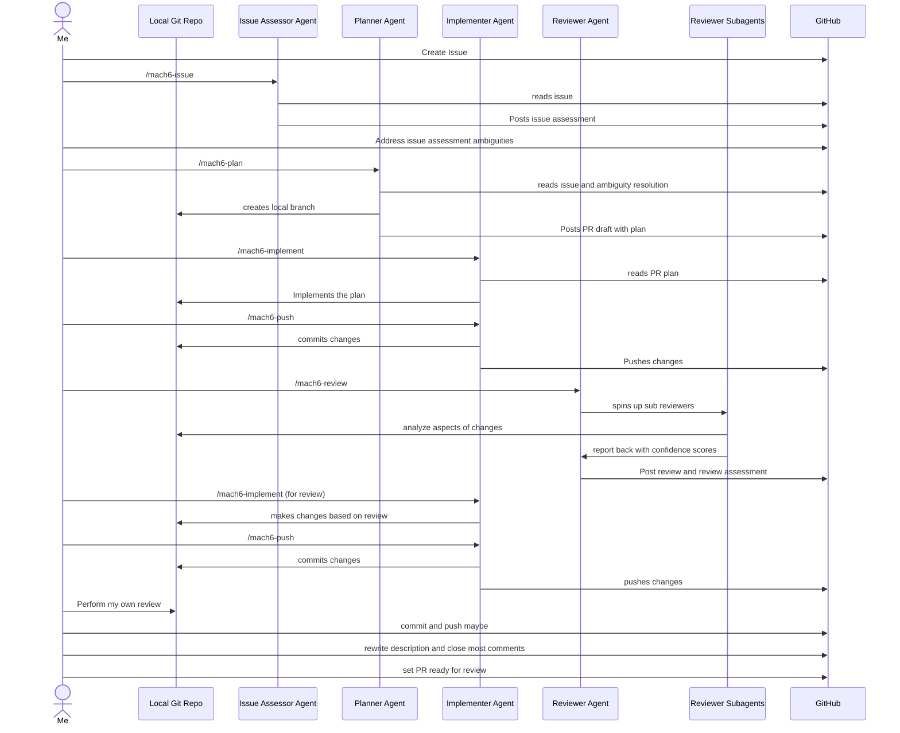
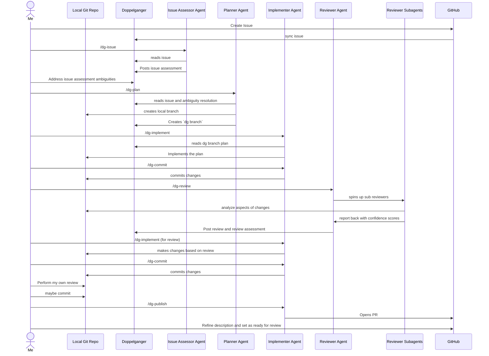

# Doppelganger


## Use Cases
Why would anyone in their right mind use this thing?

- In my case: I want a GitHub/GitLab type experience _locally_ with just me and my agents so I am not spamming AI chat all over my GitHub repo.
- Maybe you don't host your repo on any GitHub/GitLab service, but you want a local issue/branch conversation interface for you and your agents to collaborate.

### More detail on my specific use case

This app solve a very specific problem that likely wouldn't help the majority of the population.

I use the [mach6 skillset](https://github.com/Fizzizist/illustrious-manager/tree/trunk/.claude/skills) for agentic development. I like most things about it, but I wanted a local version where I didn't have to use GitHub as the main message bus between me and my agents.

Doppelganger solves this with a local interface for local issue/branch conversations between you and your team of agents.

I went from this:


to this:



## Controls

### Issue List

| Key | Action |
|-----|--------|
| `q` / `Esc` | Quit |
| `j` / `↓` | Move selection down |
| `k` / `↑` | Move selection up |
| `Enter` / `l` | Open selected issue thread |
| `n` | Create new issue (opens name input) |
| `a` | Toggle archive on selected issue |
| `A` | Toggle showing archived issues |

### Thread — Navigating

| Key | Action |
|-----|--------|
| `q` / `Esc` / `h` | Return to issue list |
| `j` / `↓` | Move selection down |
| `k` / `↑` | Move selection up |
| `e` | Edit selected item (description or comment) |
| `H` | Toggle hidden on selected comment |
| `Ctrl+u` | Scroll up |
| `Ctrl+d` | Scroll down |
| `Ctrl+w` `j` | Focus the comment input box |
| `Ctrl+w` `k` | Focus the thread |

### Thread — Comment Input Box

The input box is a [vim-mode text editor](https://crates.io/crates/hjkl-engine). All standard hjkl-engine keybindings apply. Of note:

| Key | Action |
|-----|--------|
| `Esc` | Exit insert/visual mode (or return focus to thread if already in normal mode) |
| `Enter` (normal mode) | Submit comment |
| `Enter` (insert mode) | Insert newline |

### Modals

| Key | Name Input Modal | Error Modal |
|-----|-------------------|------------|
| `Esc` | Cancel | Dismiss |
| `Enter` | Confirm | Dismiss |
| `Backspace` | Delete last character | — |
| Printable chars | Append to name | — |

## Installation

```sh
cargo install --git https://github.com/Fizzizist/doppelganger.git
```
